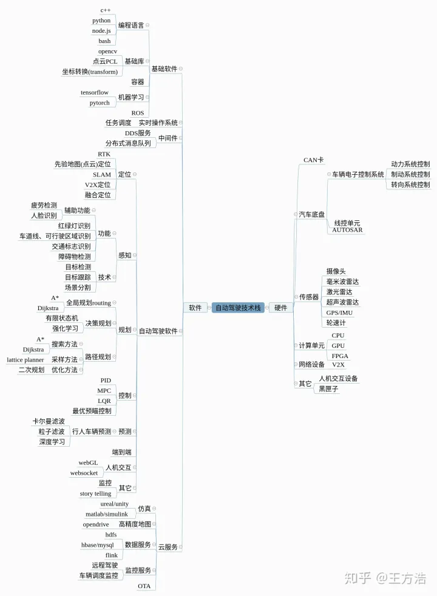

# 自动驾驶之路

- [技术栈](#技术栈)
- [自动驾驶学习资料合集](#自动驾驶学习资料合集)
- [书籍](#书籍)
- [其他内容](#其他内容)
- [练气期](#练气期 2023.03 - 2023.07)
	- [初入Apollo](#初入Apollo)
	- [ROS](#ROS)
	- [坐标系](#坐标系)
	- [规划](#规划)
	- [综述](#综述)
	- [车辆建模](#车辆建模)
	- [碰撞检测](#碰撞检测)
	- [优化](#优化)
	- [视频](#视频)
- [筑基期 2023-09 - 至今](#筑基期 2023-09 - 至今)
	- [整体知识](#整体知识)
	- [目标](#目标)
	- [c ++ 面经](#c ++ 面经)
	- [专利(实习公司布置的任务)](#专利(实习公司布置的任务))
	- [概率论](#概率论)
	- [矩阵理论](#矩阵理论)
	- [机器学习 / 深度学习 / 强化学习 练习网站](#机器学习 / 深度学习 / 强化学习 练习网站)
	- [机器学习 / 深度学习 / 强化学习 视频](#机器学习 / 深度学习 / 强化学习 视频)
	- [最优化理论](#最优化理论)
	- [论文](#论文)
	- [apollo 学习笔记](#apollo 学习笔记)
	- [apollo 视频课程](#apollo 视频课程)
	- [专栏](#专栏)
	- [综述](#综述)
	- [代码练习](#代码练习)
	- [文章](#文章)
- [待看](#待看)

## [wiki笔记](https://github.com/ProgramTraveler/Road-To-Autonomous-Driving/wiki)

## 技术栈

## 自动驾驶学习资料合集
[学习资料合集](https://zhuanlan.zhihu.com/p/58422485)
[2022自动驾驶学习资料合集](https://mp.weixin.qq.com/s?__biz=Mzg2NzUxNTU1OA==&mid=2247501925&idx=2&sn=91a31201b3ff0f8cd4de41821583efbd&chksm=ceb8e5acf9cf6cbaad374d6eb8f14636921c548b4fe0a66230728d3ede4f1c8eca2ea0baeaa1&scene=126&sessionid=1685619615#rd)

---

## 书籍

Title | Address | Replenish | Done
:-: | :-: | :-: | :-:
《动手学深度学习》 | [portal](https://book.douban.com/subject/33450010/) | 练气期阶段完成阅读 主要是计算机视觉及其前导知识 | &#x2714;
《无人驾驶原理与实践》 | [portal](https://book.douban.com/subject/30494269/) | 练气期阶段完成了规划相关的阅读 在阅读强化学习部分感觉需要补一下概率论以及强化学习的基础 筑基期阶段完成 强化学习这部分没什么可读的 太简陋了 | &#x2714;
《机器学习导论》 | [portal](https://item.jd.com/12808277.html?cu=true&utm_source=kong&utm_medium=tuiguang&utm_campaign=t_1001542270_2030030269_4100860958_3004923634&utm_term=d1db3f165cd040dcb6e64a8f47cbeceb) | | &#x2716;
《机器学习》 | [portal](https://item.jd.com/12762673.html?cu=true&utm_source=kong&utm_medium=tuiguang&utm_campaign=t_1001542270_2030030269_4100860958_3004923634&utm_term=d3b032d7c84d4f27bbe865a1e4456ab9) | | &#x2716;
《统计学习方法（第2版）》 | [portal](http://item.kongfz.com/book/64858435.html/) | | &#x2716;

---

## 其他内容

Title | Address
:-: | :-: 
程序员如何优雅记笔记 | [portal](https://mp.weixin.qq.com/s?__biz=Mzg2NzUxNTU1OA==&mid=2247503863&idx=5&sn=59d2177a426068b20ae738e72d812334&chksm=ceb8e23ef9cf6b28604fada9a48360e7e39b946350d0952cbc4ccd4f5c032c57ebc525775482&scene=126&sessionid=1685619532#rd)
控制算法手记-先学习系统动力学建模和分析 | [portal](https://mp.weixin.qq.com/s?__biz=MzU1NjEwMTY0Mw==&mid=2247552881&idx=1&sn=c1577839346919014b20f7f7571faea3&chksm=fbc87615ccbfff034f76628787f773f25aa19b361c9a53983461566c04870637b6a8531add6d&scene=126&sessionid=1685621665#rd)
最值得加入的173家国企名单 | [portal](https://mp.weixin.qq.com/s/ZDgNQSD5VoXklpJJ1nTZuQ)
2023年自动驾驶求职更新 | [portal](https://zhuanlan.zhihu.com/p/645641942)
如何画出漂亮的神经网络图？神经网络可视化工具集锦搜集 | [portal](https://mp.weixin.qq.com/s/KgkumQWuMYQIlb5aNz6nQw)
自动帮你完成物体检测标注？这个工具你必须了解一下 | [portal](https://mp.weixin.qq.com/s?__biz=MzU0MDQ1NjAzNg==&mid=2247570984&idx=1&sn=7d8800c7fbb5cbcad7d2a1132991afdf&chksm=fb3b7323cc4cfa35dc2cc6e23ec58098b4da393fa75d28ddfa70fc39404a3cbc8d26374b9ca9&scene=126&sessionid=1689829439#rd)
Git 核心操作图解 | [portal](https://mp.weixin.qq.com/s/AYHKgKR7hcGa635evCY6vA)
自动驾驶最火的比赛都在那里找？近20+自动驾驶数据集与Benchmark汇总！ | [portal](https://mp.weixin.qq.com/s/9NbZujdCfNtBi-sh-sR6cw)
超详细配置教程：用 Windows 电脑训练深度学习模型 | [portal](https://mp.weixin.qq.com/s/L_qS2ylvRYQX5LmES8shSQ)
程序员简历模板系列 | [portal](https://github.com/qiwang067/ResumeSample)
955 神仙公司名单 | [portal](https://mp.weixin.qq.com/s/FJRq5JeRI2m_zcJLpXWPdQ)
自动驾驶最新的技术栈有哪些？今天给大家盘点下 | [portal](https://mp.weixin.qq.com/s/4gq5bJkjLYbYq41XPeOSOg)

---

## 练气期 2023.03 - 2023.07

> + 这个阶段主要在了解路径规划算法 并在 ros 上跑一下仿真
> + 通过 Apollo 了解自动驾驶汽车的每个结构
> + 路径规划算法的分类以及各个算法的实现过程
> + 了解汽车运动学
> + Apollo 的源码并没有看太多 只是看的路径规划部分
> + 这个阶段以理论知识和路径规划代码为主的(通过视频、书籍、文章)

### 初入 Apollo 

#### apollo 相关指南

Title | Address
:-: | :-:
如何入手学习百度Apollo无人驾驶 | [portal](https://www.zhihu.com/question/358869380)
Apollo入门与探索 | [portal](https://apollo.baidu.com/community/column/2)
cyber入门与探索 | [portal](https://apollo.baidu.com/community/column/3)

#### 源码

[Apollo源码](https://github.com/ApolloAuto/apollo)

#### 开发者中心

[apollol开发者中心](https://developer.apollo.auto/devcenter/devcenter_cn.html)

#### 前期知识了解

Title | Address
:-: | :-:
apollo介绍 | [portal](https://zhuanlan.zhihu.com/p/52521739)	
apollo星火计划 | [portal](https://apollo.baidu.com/community/online-course/2)

#### cyber

* 准备先看一下 apollo 中的 cyber 源码和相关知识 **ps: 有个印象就好了 不用深究**
	Title | Address
	:-: | :-:
	apollo 介绍之 cyber 设计(五) | [portal](https://zhuanlan.zhihu.com/p/62259081)
	apollo 介绍之 cyber 框架(十) | [portal](https://zhuanlan.zhihu.com/p/91322837)
	apollo 介绍之 cyber 框架(十一) | [portal](https://zhuanlan.zhihu.com/p/115046708)
	apollo 介绍之 cyber 定时器(十二) | [portal](https://zhuanlan.zhihu.com/p/115990699)
	apollo 介绍之 cyber Component(十三) | [portal](https://zhuanlan.zhihu.com/p/116782645)
	apollo 介绍之 cyber Data(十四) | [portal](https://zhuanlan.zhihu.com/p/117318368)
	apollo 介绍之 cyber Schelduler 调度(十五) | [portal](https://zhuanlan.zhihu.com/p/121042548)
	apollo 介绍之 cyber Async 异步调用(十六) | [portal](https://zhuanlan.zhihu.com/p/121751141)
	apollo 介绍之 cyber 启动(十九) | [portal](https://zhuanlan.zhihu.com/p/350355878)
	apollo 介绍之 cyber 网络 IO(三十一) | [portal](https://zhuanlan.zhihu.com/p/439200783)
	apollo 介绍之 cyber 时间(三十二) | [portal](https://zhuanlan.zhihu.com/p/439568263)
	cyber record 包解析工具 | [portal](https://zhuanlan.zhihu.com/p/499516617)

* 对 apollo 中的 cyber 的大致工作流程有一个简单的印象 但是源码中的具体功能还不是很了解 源码中还有很多不是特别理解
	Title | Address
	:-: | :-:
	简述 Apollo 中 CyberRT 框架基础概念 | [portal](https://zhuanlan.zhihu.com/p/479518561)
	Apollo CyberRT 计算框架详解 | [portal](https://mp.weixin.qq.com/s/d4sLuJFiyFyL6NRhyx-i8A)
	Apollo 3.5各功能模块启动过程解析 | [portal](https://mp.weixin.qq.com/s/GEmCpKv1S5wSgJFIhr9PgQ)
	代码实践(文章没什么主要是文章最后的链接) | [portal](https://zhuanlan.zhihu.com/p/375184738)

#### planning

* 后面可能是走规划的路线 所以先看一下规划相关的东西 **ps: 未看完 后面就直接上手了**
	Title | Address
	:-: | :-:
	apollo介绍之planning模块(四) | [portal](https://zhuanlan.zhihu.com/p/61982682)

### ROS

* 对 ros 的学习 **ps: 对于 ros 我只是粗浅的学习了一些基本的知识 可以使用和理解代码的程度**
	Title | Address
	:-: | :-:
	ros入门 | [portal](https://www.bilibili.com/video/BV1Ci4y1L7ZZ/?spm_id_from=333.1007.top_right_bar_window_custom_collection.content.click&vd_source=c68460d92fb2b166884357ad8c98de03)
	ros入门文档 | [portal](http://www.autolabor.com.cn/book/ROSTutorials/chapter1.html)
	ros1和ros2的区别 | [portal](https://mp.weixin.qq.com/s?__biz=MzU1NjEwMTY0Mw==&mid=2247569968&idx=1&sn=2731841748d899578ac2a0e50a95b74e&chksm=fbc9ab54ccbe2242ccddec689ea666bbc42c7ebc27845f63186b7909bf165409b2c84fba8117&scene=126&sessionid=1685621388#rd)
	ros 菜鸟安装(如果觉得配置环境太麻烦 一键安装) | [portal](https://azitide.github.io/post/ubuntu_ROS.html)
	如何学习ROS？ | [portal](https://www.zhihu.com/question/35788789/answer/580258849) 
	入门学习ROS时遇到的最大困难是什么？ | [portal](https://www.zhihu.com/question/296233185/answer/571007197) 
	ros与机器人 | [portal](https://mp.weixin.qq.com/s?__biz=MzU1NjEwMTY0Mw==&mid=2247574804&idx=1&sn=a7dcd992a6e55c571dc7a5631a764705&chksm=fbc9dc70ccbe5566132c3f5591eb6db7b521480f32195a783dfd7e0a5908bf64222dbfb459a5&scene=126&sessionid=1685621256#rd)

### 坐标系

* 在泊车的坐标系大致分为 三种 分别是 **车辆坐标系** **世界坐标系** **栅格坐标系**
* 在规划的过程中需要不断变换坐标系进行计算
* 变换的时候容易混乱
	Title | Address | Replenish
	:-: | :-: | :-:
	一文详解自动驾驶中的时空坐标系 | [portal](https://mp.weixin.qq.com/s?__biz=Mzg2NzUxNTU1OA==&mid=2247541443&idx=4&sn=159f600d3e171e497f842d4b8c8c13f5&chksm=ceb80f0af9cf861c3733fea58444165a23150a88593ebdf826fc709dbe4a7458a405b475e93c&scene=126&sessionid=1685618763#rd) | 给出每个坐标系下的公式计算(无推导过程)
	一文理清标定中的坐标变换 | [portal](https://mp.weixin.qq.com/s?__biz=MzU1NjEwMTY0Mw==&mid=2247486325&idx=1&sn=19819c6d26b6792f0bcc0fe1b0fab9a2&chksm=fbcb7211ccbcfb07c16177a3cb938e5d9db6ef44eb07b9d3d6e91a315ed146b1e6c1150944f3&scene=126&sessionid=1685622515#rd) | **标定？** 现在似乎还没用上
	干货 欧拉角、四元数？晕头转向的空间姿态表示法(上篇) | [portal](https://mp.weixin.qq.com/s?__biz=MzU1NjEwMTY0Mw==&mid=2247486211&idx=1&sn=c6ef408285035a041b23acf276414b38&chksm=fbcb7267ccbcfb71d548f734d5290ef141f254591bc62ea7aa02c9bbe41d99c748325fe2e243&scene=126&sessionid=1685622531#rd) | &#x2716;
	干货 欧拉角，四元数？晕头转向的空间姿态表示法(下篇) | [portal](https://mp.weixin.qq.com/s?__biz=MzU1NjEwMTY0Mw==&mid=2247486284&idx=1&sn=34ff91b951ebfe4f21ce9e4f511bfe3e&chksm=fbcb7228ccbcfb3e55b4a2b4de89a166e0467b1358a1030f15949cf1d97baa83a67e64cd0fa1&scene=126&sessionid=1685622515#rd) | &#x2716;
	干货 位置角度平移旋转 “乱七八糟”的坐标变换 | [portal](https://mp.weixin.qq.com/s?__biz=MzU1NjEwMTY0Mw==&mid=2247485768&idx=1&sn=13a92a0f9d1a7266f2cc6449bf6002eb&chksm=fbcb702cccbcf93a03feb15b98f3474b5ea70e2129cabbce5e57f3e0152c7ae26da6b1ab0c9c&scene=126&sessionid=1685622578#rd) | &#x2716;
	ROS TF添加一个坐标系 | [portal](https://mp.weixin.qq.com/s?__biz=MzU1NjEwMTY0Mw==&mid=2247513185&idx=2&sn=1c18b7966416278ca33845cfde0c95fc&chksm=fbc8cd05ccbf44132dfd8efd34b6981b34e55110968fa781e182b0c42be6773caa1eb0c51e93&scene=126&sessionid=1685622214#rd) | &#x2716;
	ROS技术点滴 —— tf坐标变换库 | [portal](https://mp.weixin.qq.com/s?__biz=MzU1NjEwMTY0Mw==&mid=2247485865&idx=1&sn=1be2771b05ee1db1becbf0b5880be06f&chksm=fbcb70cdccbcf9dbf702b7e48c9abc19c8822c976e2683c3656c235b1f4ca6c985f36463bae5&scene=126&sessionid=1685622683#rd) | &#x2716;
	ROS TF2-通过tf2_ros::MessageFilter 将世界坐标系下的点转为期望坐标系下的点 | [portal](https://mp.weixin.qq.com/s?__biz=MzU1NjEwMTY0Mw==&mid=2247514456&idx=1&sn=a8319e8e282bfe85af37340727887ecd&chksm=fbc8c03cccbf492a457046270df76602d5a7c0fa52f25f86be8168a406c93d913d8e21864d84&scene=126&sessionid=1685622173#rd) | &#x2716;
	TF2 坐标变换-监听实例 | [portal](https://mp.weixin.qq.com/s?__biz=MzU1NjEwMTY0Mw==&mid=2247514325&idx=1&sn=6f5c78fd846d7307440200216e047879&chksm=fbc8c1b1ccbf48a7b5fd679f09318acc9f0550db81cb6ebc94d67136b243ffe362a31c17c84b&scene=126&sessionid=1685622173#rd) | &#x2716;

### 规划

* 最近在尝试做规划算法的具体实践
	Title | Address | Replenish
	:-: | :-: | :-:
	实现一下 混合A\* 在泊车方面的效果 | [项目传送门](https://github.com/ProgramTraveler/Narrow_and_Crowded_Spaces) | 这让我对算法的思路和代码的具体实现有了一个初入的了解 也更容易让我读源码 百度的 apollo 或许更适合去当一个说明书？
	AutowareAuto泊车案例复现及原理简介 | [portal](https://mp.weixin.qq.com/s?__biz=MzU1NjEwMTY0Mw==&mid=2247571086&idx=1&sn=a53c100dc997a0c4eba55d8032cddd8c&chksm=fbc9afeaccbe26fcf56023de7e1fc21d5110cac625404254a6871843a3d9e2f064ea7f071409&scene=126&sessionid=1685621360#rd) | 看看就行
	
#### 运动规划

Title | Address | Replenish
:-: | :-: | :-:
机器人运动规划算法研究现状简述 | [portal](https://mp.weixin.qq.com/s?__biz=MzU1NjEwMTY0Mw==&mid=2247558390&idx=1&sn=d77b7672eb613350e0a2f0ca1fe90dd9&chksm=fbc99d92ccbe1484ee3da8ae12d198b349eeb4879dab4ee739112702de487ae7753f1a1fd87b&scene=126&sessionid=1685621516#rd) | [wiki笔记(算法优缺点)](https://github.com/ProgramTraveler/Road-To-Autonomous-Driving/wiki/%E6%9C%BA%E5%99%A8%E4%BA%BA%E8%BF%90%E5%8A%A8%E8%A7%84%E5%88%92%E7%AE%97%E6%B3%95%E7%A0%94%E7%A9%B6%E7%8E%B0%E7%8A%B6%E7%AE%80%E8%BF%B0)
聊一聊自动驾驶规划中的优化问题 | [portal](https://zhuanlan.zhihu.com/p/585825996) | 内容一般 有价值的东西不多(未入门的可以看一下)
运动规划系列合集 | [portal](https://mp.weixin.qq.com/mp/appmsgalbum?__biz=MzI3MTIyMjQwNQ==&action=getalbum&album_id=2236876593568858115&scene=173&from_msgid=2247483715&from_itemidx=1&count=3&nolastread=1#wechat_redirect) | Have read
自动驾驶决策规划技术详解(全局规划/行为决策/运动规划) | [portal](https://mp.weixin.qq.com/s?__biz=Mzg2NzUxNTU1OA==&mid=2247534999&idx=3&sn=74fee34efb73c05bb5014533562bf94a&chksm=ceb8645ef9cfed48314915c5369ec248d54e3d7048028afaddef6a8f02efd202812545a5cc6b&scene=126&sessionid=1685618895#rd) | [wiki笔记](https://github.com/ProgramTraveler/Road-To-Autonomous-Driving/wiki/%E8%87%AA%E5%8A%A8%E9%A9%BE%E9%A9%B6%E5%86%B3%E7%AD%96%E8%A7%84%E5%88%92%E6%8A%80%E6%9C%AF%E8%AF%A6%E8%A7%A3(%E5%85%A8%E5%B1%80%E8%A7%84%E5%88%92%E3%80%81%E8%A1%8C%E4%B8%BA%E5%86%B3%E7%AD%96%E3%80%81%E8%BF%90%E5%8A%A8%E8%A7%84%E5%88%92))
无人驾驶路径规划（三）局部路径规划-Frenet坐标系下的动态轨迹规划 | [portal](https://mp.weixin.qq.com/s?__biz=MzU1NjEwMTY0Mw==&mid=2247573290&idx=1&sn=17ab567a8748c61e7dd05d60df803dce&chksm=fbc9a64eccbe2f58c260d345c6ddcfa078daa27d71c5f0dfb72050bde114e5dc968aed71695c&scene=126&sessionid=1685621317#rd) | [原文链接(有些图片失效了)](https://www.guyuehome.com/40491) 没有什么参考价值 公式都是贴图
从一踏上自动驾驶上下求索之路（五）——规划 | [portal](https://zhuanlan.zhihu.com/p/585825996) | 都是大白话 基础的东西

#### 规划算法

Title | Address
:-: | :-:
路径规划算法合集 | [portal](https://mp.weixin.qq.com/mp/appmsgalbum?__biz=MzU1NjEwMTY0Mw==&action=getalbum&album_id=2430883367362592769&scene=173&from_msgid=2247580065&from_itemidx=1&count=3&nolastread=1#wechat_redirect)
自动驾驶路径规划五大常用算法 | [portal](https://mp.weixin.qq.com/s?__biz=Mzg2NzUxNTU1OA==&mid=2247506660&idx=4&sn=8d28790e4e04596878599ab29cc1e538&chksm=ceb8f72df9cf7e3b20f4202279bff61454c2ee973956e4f796ca064d15dbd07c9cc6a6ab379b&scene=126&sessionid=1685619485#rd)

##### A\* 算法

Title | Address
:-: | :-:
决策、规划通俗易懂聊 A\* 算法 | [portal](https://mp.weixin.qq.com/s?__biz=Mzg2NzUxNTU1OA==&mid=2247521925&idx=3&sn=87b5eb0d1175235dbc3d224833088dcf&chksm=ceb8bb4cf9cf325a6bb5e5b0dab5cda7e7f56123edf35d8564a6a1da9ea1a7b55707a5bf9e6f&scene=126&sessionid=1685619222#rd)
A\* 算法-启发式算法 | [portal](https://mp.weixin.qq.com/s?__biz=MzU1NjEwMTY0Mw==&mid=2247578122&idx=1&sn=bd273c189bc8c79d65c41c876f6ac9b7&chksm=fbc9cb6eccbe4278ed6261e77f2be94a319c45a9ba18622e7bf233dfe1eca07fcbc75c182279&scene=126&sessionid=1685621064#rd)
自动驾驶路径规划-A\* 算法 | [portal](https://mp.weixin.qq.com/s?__biz=MzU1NjEwMTY0Mw==&mid=2247577202&idx=1&sn=f4ea8c5fcd176ace130c11227ea09e59&chksm=fbc9d716ccbe5e00ac2af1c120236f9d4adeb375b0847ee3ee784dada75649e2b6a11eac8dbd&scene=126&sessionid=1685621139#rd)

##### 混合 A\* 算法

Title | Address | Replenish
:-: | :-: | :-:
混合A\* 算法研究 | [portal](https://blog.csdn.net/robinvista/article/details/106279968) | 我认为写的不错的一个博客 初次对规划算法的了解 **ps: 原作者似乎开启了vip... 之前还能看**
自动泊车实例 | [portal](https://www.guyuehome.com/author/617f950de99b5) | 对混合A\* 结合代码的讲解
规划控制 Hybrid A\* 算法仿真实践 | [portal](https://mp.weixin.qq.com/s?__biz=Mzg2NzUxNTU1OA==&mid=2247523450&idx=3&sn=dddcc5a5b9103553347cab9c2edeaa32&chksm=ceb8b1b3f9cf38a5d7bebeeb2f9c96545910d091b62e8e1178bf9ec069dc7d607e4d9bbed1fa&scene=126&sessionid=1685619187#rd) | Have read
规划控制 详解自动驾驶轨迹规划 Hybrid A\* 算法 | [portal](https://mp.weixin.qq.com/s?__biz=Mzg2NzUxNTU1OA==&mid=2247530419&idx=2&sn=45f1201efe4fbf51415df01e5c2b7377&chksm=ceb85a7af9cfd36c6536a313558de3346ee0e5b55e3a49f1e3d3ce5cad91bd81595503b44bd2&scene=126&sessionid=1685619036#rd) | Have read
混合A\* 算法研究 | [portal](https://mp.weixin.qq.com/s?__biz=MzU1NjEwMTY0Mw==&mid=2247573889&idx=1&sn=4ce63d439ef186a119c5909021c49b06&chksm=fbc9d8e5ccbe51f3c8c49ef2fb7e9559c6eaf75778a69107b6f930f0ab3b8725cde90166bf1f&scene=126&sessionid=1685621296#rd) | Have read
自动驾驶轨迹规划之 hybrid A\* 算法 | [portal](https://mp.weixin.qq.com/s/DqhotGszG-ayBUmc_dMo8Q) | [原文地址](https://blog.csdn.net/weixin_65089713/article/details/124060155)
Hybrid A\* 原理与代码 | [portal](zhuanlan.zhihu.com/p/635971229) | 说的挺详细的 对参数和过程不熟悉的推荐看一下

### 综述

Title | Address | Wiki or Replenish
:-: | :-: | :-:
自动驾驶决策控制及运动规划最详细最接地气综述(2022年) | [portal](https://zhuanlan.zhihu.com/p/260707853) | [Wiki笔记](https://github.com/ProgramTraveler/Road-To-Autonomous-Driving/wiki/%E8%87%AA%E5%8A%A8%E9%A9%BE%E9%A9%B6%E5%86%B3%E7%AD%96%E6%8E%A7%E5%88%B6%E5%8F%8A%E8%BF%90%E5%8A%A8%E8%A7%84%E5%88%92%E7%BB%BC%E8%BF%B0(2022))
综述-深度强化学习在自动驾驶中的应用 | [portal](https://mp.weixin.qq.com/s?__biz=Mzg2NzUxNTU1OA==&mid=2247516587&idx=3&sn=17c18a4055b220ebc264ac80731dcfa9&chksm=ceb8ac62f9cf2574c678ad1a9ddd52b89f2b0bd7aaab46f7621aae68869d999e22efdea84d8b&scene=126&sessionid=1685619283#rd) | Have read
综述-城市道路自动驾驶车辆规划与控制技术 | [portal](https://mp.weixin.qq.com/s?__biz=Mzg2NzUxNTU1OA==&mid=2247526408&idx=2&sn=9a05116c4538a641872c965ab7b5a812&chksm=ceb845c1f9cfccd77bf6c1893776898bf483b7e07b40130d1671299ef3b86799e65c01caf1e9&scene=126&sessionid=1685619108#rd) | 2016 年的一篇综述 其中内容包含较多 主要还是关注的规划部分 [wiki笔记](https://github.com/ProgramTraveler/Road-To-Autonomous-Driving/wiki/%E7%BB%BC%E8%BF%B0_%E5%9F%8E%E5%B8%82%E9%81%93%E8%B7%AF%E8%87%AA%E5%8A%A8%E9%A9%BE%E9%A9%B6%E8%BD%A6%E8%BE%86%E8%A7%84%E5%88%92%E4%B8%8E%E6%8E%A7%E5%88%B6%E6%8A%80%E6%9C%AF)

### 车辆建模

Title | Address | Replenish
:-: | :-: | :-:
车辆运动学建模(一) | [portal](https://www.guyuehome.com/42662) | 说的并不详细 感觉就是把公式再抄一遍 没有收获!!!
车辆运动学建模(二) | [portal](https://www.guyuehome.com/42664) | 说的并不详细 感觉就是把公式再抄一遍 没有收获!!!
移动机器人(一)-运动模型 | [portal](https://www.guyuehome.com/18424) | 主要看的是 car-like mobile 部分
Car-like Robot运动模型及应用分析 | [portal](https://mp.weixin.qq.com/s/hCAzGJDSZFsFHoC5hTVsjA) | 对模型设计和数学推导详细 比大部分的博客强 [wiki笔记](https://github.com/ProgramTraveler/Road-To-Autonomous-Driving/wiki/Car-like-Robot%E8%BF%90%E5%8A%A8%E6%A8%A1%E5%9E%8B%E5%8F%8A%E5%BA%94%E7%94%A8%E5%88%86%E6%9E%90)
无人车系统(一)-运动学模型及其线性化 | [portal](https://mp.weixin.qq.com/s?__biz=MzU1NjEwMTY0Mw==&mid=2247574228&idx=1&sn=89cd2b9ee502d81ded3756678f7f80a5&chksm=fbc9dbb0ccbe52a683110dff554fa094ec32c3a68bdf379045cf26340b6aa5261e62ceb042d1&scene=126&sessionid=1685621296#rd) | Have read

### 碰撞检测

Title | Address | Replenish
:-: | :-: | :-:
机器人碰撞检测几何模型设计 | [portal](https://mp.weixin.qq.com/s?__biz=MzU1NjEwMTY0Mw==&mid=2247559064&idx=1&sn=0c45aedb2561d8a143a3371412ca278d&chksm=fbc99efcccbe17eaf10874b6d27697360ab5ed292edec6d62c5844c9927f23efa71cf89c7d4b&scene=126&sessionid=1685621516#rd) | Have read

### 优化

Title | Address | Replenish
:-: | :-: | :-:
贝叶斯优化(原理+代码解读) | [portal](https://zhuanlan.zhihu.com/p/390373572) | Have read

#### 视频课程

Title | Address | Wiki or Replenish
:-: | :-: | :-:
自动驾驶汽车 专项课程(多伦多大学) | [portal](https://www.coursera.org/specializations/self-driving-cars?#enroll) | 主要看的是 Motion Planning for Self-Driving Cars 这章[wiki笔记](https://github.com/ProgramTraveler/Road-To-Autonomous-Driving/wiki/%E8%87%AA%E5%8A%A8%E9%A9%BE%E9%A9%B6%E6%B1%BD%E8%BD%A6-%E4%B8%93%E9%A1%B9%E8%AF%BE%E7%A8%8B(%E5%A4%9A%E4%BC%A6%E5%A4%9A%E5%A4%A7%E5%AD%A6)-Motion-Planning-for-Self-Driving-Cars) 以及 Introduction to Self-Dring Cars 中的 Dynamic Modeling(第四周内容) [wiki笔记](https://github.com/ProgramTraveler/Road-To-Autonomous-Driving/wiki/%E8%87%AA%E5%8A%A8%E9%A9%BE%E9%A9%B6%E6%B1%BD%E8%BD%A6-%E4%B8%93%E9%A1%B9%E8%AF%BE%E7%A8%8B(%E5%A4%9A%E4%BC%A6%E5%A4%9A%E5%A4%A7%E5%AD%A6)-Introduction-to-Self-Driving-Cars) **有的视频并没有翻译 生肉啃起来有点难受 有些翻译的可能有点问题**

### 视频

Title | Address | Replenish
:-: | :-: | :-:
无人驾驶系列知识入门到提高 | [portal](https://www.bilibili.com/video/BV137411E7oC?p=10&vd_source=c68460d92fb2b166884357ad8c98de03) | 只看了 路径规划部分 内容比较基础(时间比较久了 质量也一般 感觉还是国外的好一点 2020年的) 有知识前提的观看更好一点 `up主`的主页有其他内容

## 筑基期 2023-09 - 至今

> + 规划控制不分家
> + 在对理论知识有一定了解后 就想再深入一下 就把 Apollo 的相关视频课看了一遍 顺便查漏补缺
> + 通过代码把 规划/控制算法 的理论通过代码实现
> + 后面发现绕不开得去学习 强化学习 就开始补强化学习知识(在这之前已经读完 《动手读深度学习》 并把代码都敲了一遍)
> + 在学习的过程中 建议搭配 Hugging Face Hub 和 kaggle 食用

### 整体知识

* 方向

* 自动驾驶之心规划控制理论课程大纲(2023年)

### 目标

* 对网上一些高赞回答(主要还是知乎)进行一些浏览 总结了回答的主要内容 针对 自动驾驶决策、规划、控制方向 ---> [传送门](https://www.zhihu.com/question/351757965/answer/864850362)
* 大部分内容在练气期时已经了解的差不多了 但是感觉还是差点意思
* 想参考一下`自动驾驶之心的课程大纲`来查漏补缺
* c ++ 编程
* 控制算法？
* 基础的规控算法(A\*, RRT\*, Lattice based, MPC, POMDP, PID, LQR等)
* 参数化曲线构造(多项式、贝塞尔、样条曲线)
* 数值优化常用方法
* 常用算法实现(一阶低通滤波、pid、卡尔曼)
* 理解 lqr mpc 原理 知道缺点和使用条件 针对规划 理解基本的线性拟合
* ros
* 状态机、决策系统
* 掌握 AI 决策规划 这里面分有监督学习和强化学习
* apllo 代码

### c ++ 面经

* [CppMaster](https://github.com/ProgramTraveler/CppMaster)

### 专利(实习公司布置的任务)

* [专利查询网站](http://www2.soopat.com/Home/Index)
* [佰腾](https://www.baiten.cn/)
* 参考的一些专利文章在 patent 文件中
* [如何写专利？](https://www.zhihu.com/question/21066904)
* 我觉得回答不错的
* [如何写专利？-海绵叔叔的回答](https://www.zhihu.com/question/21066904/answer/140745693)
* [如何写专利？-说 明 书(撰写示例)---机械类专利适用](https://www.zhihu.com/question/21066904/answer/792229301)

### 概率论

Title | Address | Replenish | Done
:-: | :-: | :-: | :-:
吃透《统计学习方法》 | [portal](https://www.bilibili.com/video/BV1tZ4y1U7ot/?spm_id_from=333.999.0.0&vd_source=c68460d92fb2b166884357ad8c98de03) | | &#x2716;

### 矩阵理论

Title | Address | Done
:-: | :-: | :-:
【完整版-麻省理工-线性代数】全34讲+配套教材 | [portal](https://www.bilibili.com/video/BV1ix411f7Yp/?vd_source=c68460d92fb2b166884357ad8c98de03) | &#x2716;
新MIT 线性代数|机器学习（中英机翻字幕）18.065 by Gilbert Strang | [portal](https://www.bilibili.com/video/BV1a7411M7wH/?vd_source=c68460d92fb2b166884357ad8c98de03) | &#x2716;
(高清重制)麻省理工学院 MIT 18.06 线性代数 | [portal](https://www.bilibili.com/video/BV1iU4y1K7oZ/?spm_id_from=333.999.0.0&vd_source=c68460d92fb2b166884357ad8c98de03) | &#x2716;

### 机器学习 / 深度学习 / 强化学习 练习网站

* 还是没逃过 ML、DL、RL 的魔爪

Title | Address | Replenish | Done
:-: | :-: | :-: | :-:
Hugging Face | [portal](https://huggingface.co/welcome) | 主要是 learn 深度强化学习 推荐入门学习 了解算法过程和原理 | &#x2714;
该仓库包含中文翻译的 Hugging Face 深度强化学习课程大纲 | [portal](https://github.com/qiwang067/deep-rl-class-zh-CN) | 看不懂的可以看一下这个中文翻译 中文课程在 notebook 文件中 | &#x2714;
kaggle | [portal](https://www.kaggle.com/) | 里面的人说话又好听 个个都是人才 我超喜欢这里的 | &#x2714;
强化学习的基本算法 | [portal](https://github.com/johnjim0816/rl-tutorials) | 项目地址更新了 强化学习基本算法都有源码 | &#x2714;
Deep-Reinforcement-Learning-Algorithms | [portal](https://github.com/Rafael1s/Deep-Reinforcement-Learning-Algorithms) | 深度强化学习算法具体应用 这个更直观一点 有图有真相 | learing
python | [portal](https://www.udacity.com/course/introduction-to-python--ud1110) | ？想重新拾起python | &#x2714;
PyTorch 深度学习简介 | [port](https://www.udacity.com/course/deep-learning-pytorch--ud188) | 框架得学一下吧 | &#x2716;
60 分钟内的 PyTorch | [portal](https://pytorch.org/tutorials/beginner/deep_learning_60min_blitz.html) | 这次一定 | &#x2716;
深度学习入门之PyTorch | [portal](https://github.com/qiwang067/code-of-learn-deep-learning-with-pytorch) | 了解了解得了 | &#x2716;
本项目将《动手学深度学习》(Dive into Deep Learning)原书中的 MXNet 实现改为PyTorch实现 | [portal](https://github.com/qiwang067/Dive-into-DL-PyTorch) | 我之前是把 MXNet 版本的敲了一遍 | &#x2714;
《机器学习》（西瓜书）公式推导解析 | [portal](https://github.com/qiwang067/pumpkin-book) | 等着搭配实书食用 | &#x2716;
《李宏毅深度学习教程》 PDF下载 | [portal](https://github.com/datawhalechina/leedl-tutorial) | 收藏从未停止 |  &#x2716;
深度学习500问，以问答形式对常用的概率知识、线性代数、机器学习、深度学习、计算机视觉等热点问题进行阐述 | [portal](https://github.com/scutan90/DeepLearning-500-questions) | 对理论有困惑可以常来看看 | &#x2714;
一个优雅的 PyTorch 深度强化学习库 | [portal](https://github.com/johnjim0816/tianshou) | 扶我起来 还能学 | &#x2714;
蘑菇书EasyRL | [portal](https://github.com/datawhalechina/easy-rl) | 我直接看的实体书 | &#x2714;
李宏毅（Hung-Yi Lee）指导的 15 个机器学习作业的代码和幻灯片 2022 | [portal](https://github.com/yyysjz1997/ML2022-Spring) | ML | &#x2716;
这是《Learn Deep Learning with PyTorch》一书的代码 | [portal](https://github.com/qiwang067/code-of-learn-deep-learning-with-pytorch) | 大佬的仓库收藏就对了 | &#x2716;
适合所有人的开源机器学习框架 | [portal](https://github.com/yyysjz1997/tensorflow) | 不知道适不适合我 | &#x2716;

### 机器学习 / 深度学习 / 强化学习 视频

Title | Address | Replenish | Done
:-: | :-: | :-: | :-:
2022吴恩达机器学习Deeplearning.ai课程 | [portal](https://www.bilibili.com/video/BV1Pa411X76s/?spm_id_from=333.999.0.0&vd_source=c68460d92fb2b166884357ad8c98de03) | | &#x2716;
深度学习超全实战项目合集 | [portal](https://www.bilibili.com/video/BV1ut4y1S7gP/?spm_id_from=333.999.0.0&vd_source=c68460d92fb2b166884357ad8c98de03) | | &#x2716;
李宏毅2023春机器学习课程 | [portal](https://www.bilibili.com/video/BV1TD4y137mP/?spm_id_from=333.999.0.0&vd_source=c68460d92fb2b166884357ad8c98de03) | |  &#x2716;
李宏毅2021/2022春机器学习课程 | [portal](https://www.bilibili.com/video/BV1Wv411h7kN/?vd_source=c68460d92fb2b166884357ad8c98de03) | | &#x2716;
浙江大学-机器学习 | [portal](https://www.bilibili.com/video/BV1qf4y1x7kB/?spm_id_from=333.999.0.0&vd_source=c68460d92fb2b166884357ad8c98de03) | | &#x2716;
强化学习之基础(英文 无中文字幕) | [portal](https://www.bilibili.com/video/BV1Gb411J7WN/?vd_source=c68460d92fb2b166884357ad8c98de03) | 留给听力好的 | &#x2714;
强化学习及其在竞速无人机中的应用 | [portal](https://link.zhihu.com/?target=https%3A//www.shenlanxueyuan.com/open/course/99%3Fzhihu) | 个人爱好 | &#x2714;

### 最优化理论

Title | Address | Replenish | Done
:-: | :-: | :-: | :-:
最优化理论 | [portal](https://space.bilibili.com/507629580) | | &#x2716;

### 论文

Title | Address
:-: | :-:
轨迹预测与运动预测相关paper汇总 | [portal](https://github.com/colorfulfuture/Awesome-Trajectory-Motion-Prediction-Papers)

### apollo 学习笔记

* [apollo 学习笔记](https://github.com/daohu527/dig-into-apollo)

### apollo 视频课程

* 最初的时候也看了一点 apollo 的视频课 但浅尝辄止
* 准备扫一下盲

Title | Address | Replenish
:-: | :-: | :-:
Apollo b站首页 | [portal](https://space.bilibili.com/631671239/channel/series) | 不定期分享内容
Apollo 视频课主页 | [portal](https://apollo.baidu.com/community/online-course) | 不定期更新
自动驾驶新人之旅 | [portal](https://apollo.baidu.com/community/online-course/11) | 这个入门级的 对安装环境和技术介绍
Apollo 自动驾驶入门课程 | [portal](https://apollo.baidu.com/community/online-course/1) | 看的是规划和控制部分 **ps:每个视频就两分钟左右 （吐槽不会自动跳到下一集）** 算是对之前学到的东西复习一下
Apollo 星火计划 2.0 | [portal](https://apollo.baidu.com/community/online-course/2) | 对 Apollo **代码模块**的讲解 看的是规划模块和控制模块部分 建议带着代码一起看
Apollo 自动驾驶技术详解 25 讲 | [portal](https://apollo.baidu.com/community/online-course/77) | 看的是自动驾驶规划技术和控制技术部分 主要是 apollo 结构
Apollo 星火计划之 PnC 专项 | [portal](https://apollo.baidu.com/community/online-course/12) | 自动驾驶决策规划技术 &#x2716;
2023-Apollo星火培训PnC专项 | [portal](https://apollo.baidu.com/community/online-course/409) | &#x2716;

### 专栏

Title | Address | Replenish
:-: | :-: | :-:
无人驾驶技术系统 | [portal](https://blog.csdn.net/u013468614/category_9577860.html?spm=1001.2014.3001.5482) | 大部分是公式推导 有仿真的代码测试
自动驾驶规划入门（已完结） | [portal](https://blog.csdn.net/u013468614/category_11897666.html?spm=1001.2014.3001.5482) | 质量不知道怎么样（收费的）**感觉没必要** 里面的内容随便都能找到
Apollo自动驾驶预测规划控制算法 | [portal](https://blog.csdn.net/qq_41667348/category_11789612.html) | Have read

### 综述

Title | Address | wiki
:-: | :-: | :-:
何为轨迹预测？我们为什么需要轨迹预测？(自动驾驶轨迹预测-综述) | [portal](https://zhuanlan.zhihu.com/p/365881810) | [wiki笔记](https://github.com/ProgramTraveler/Road-To-Autonomous-Driving/wiki/%E4%BD%95%E4%B8%BA%E8%BD%A8%E8%BF%B9%E9%A2%84%E6%B5%8B%EF%BC%9F%E6%88%91%E4%BB%AC%E4%B8%BA%E4%BB%80%E4%B9%88%E9%9C%80%E8%A6%81%E8%BD%A8%E8%BF%B9%E9%A2%84%E6%B5%8B%EF%BC%9F(%E8%87%AA%E5%8A%A8%E9%A9%BE%E9%A9%B6%E8%BD%A8%E8%BF%B9%E9%A2%84%E6%B5%8B%E2%80%90%E7%BB%BC%E8%BF%B0))
最新综述 自动驾驶决策都有哪些数据集？一文尽览 | [portal](https://mp.weixin.qq.com/s?__biz=Mzg4Mjg4NTQxMQ==&mid=2247496504&idx=1&sn=a7bc87db21e05b332cdfa377b7047d4c&chksm=cf4d6574f83aec62ee3fa4b78cb6d3a2776e392b0be2b7835f49cfa9de9b5e4779df9376af7f&scene=126&sessionid=1689646386#rd) | Have read

### 代码练习

Title | Address | Replenish
:-: | :-: | :-:
c++ 手撕A\* 路径规划算法 | [portal](https://www.bilibili.com/video/BV1wj411o74g/?buvid=XU058230ACE37A3A9500A39749582251BD773&is_story_h5=false&mid=jAQpmOC5Knl3UoDmHKlpcg%3D%3D&p=1&plat_id=116&share_from=ugc&share_medium=android&share_plat=android&share_session_id=8cd5d0ae-3603-4bab-8743-9853cb41234f&share_source=WEIXIN&share_tag=s_i&timestamp=1691680668&unique_k=2SBhJ2y&up_id=15496050&vd_source=c68460d92fb2b166884357ad8c98de03) |  [不想看视频可以直接看我代码](https://github.com/ProgramTraveler/Auto_driving_alg/blob/master/A*_planning/main.cpp)
规划控制代码实战-视频 | [portal](https://www.ixigua.com/home/3642002077926135/?source=pgc_author_profile&list_entrance=anyVideo) | 说是实战 但无代码
自动驾驶决策规划控制c++代码实现 | [portal](https://github.com/CHH3213/chhRobotics_CPP) | 配环境ing
强化学习在MPC上的使用 | [portal](https://github.com/tud-amr/go-mpc) | [个人理解](https://github.com/ProgramTraveler/github-wiki/blob/master/%E7%AD%91%E5%9F%BA%E6%9C%9F/%E4%BB%A3%E7%A0%81/Go-MPC/%E5%AE%9E%E7%8E%B0%E6%96%B9%E6%B3%95/%E5%AE%9E%E7%8E%B0%E6%96%B9%E6%B3%95.pdf)

### 文章

Title | Address | Replenish
:-: | :-: | :-:
万字聊聊百度Apollo自顶向下的自动驾驶之路 | [portal](https://zhuanlan.zhihu.com/p/587873388) | Have read
汇总！自动驾驶路径规划中的障碍物处理方法总结 | [portal](https://zhuanlan.zhihu.com/p/635971229) | 相关文献中 障碍物约束处理的常用处理方法
一文搞懂梯度下降 | [portal](https://mp.weixin.qq.com/s?__biz=MzU1NjEwMTY0Mw==&mid=2247579745&idx=1&sn=8341b972c8d3488c3852b5ebe5779b05&chksm=fbc9c105ccbe4813915e5abaae5fff5fa7dca691ea619e59d849ba32dd81221cc89e20fc34a9&scene=126&sessionid=1685620969#rd) | 怎么感觉是吴恩达老师的 PPT？
三张图读懂机器学习：基本概念、五大流派与九种常见算法 | [portal](https://mp.weixin.qq.com/s?__biz=Mzg3MjY1MzExMA==&mid=2247506290&idx=2&sn=87afa8e60d542a874eb255b00504dff9&chksm=ceee912bf999183da1c1f5db17684e4c42eb9ca6c6597e1c10615470cf57ec349af106ec8066&scene=126&sessionid=1689670185#rd) | 就简单介绍了下基本概念 适用场景 公式、具体思想都没有
图解 72 个机器学习基础知识点 | [portal](https://mp.weixin.qq.com/s/j3MMf-S-SqhqbJl3JnIxsg) | 算是对基本术语的解释

---

## 待看

* 一些文章或视频 还没来得及看 先记录在这里
* [从欧拉角到旋转位移矩阵再到变换矩阵](https://mp.weixin.qq.com/s?__biz=MzU1NjEwMTY0Mw==&mid=2247552280&idx=2&sn=19b0caceb0278fa803bdf7cc4b1158d1&chksm=fbc8747cccbffd6a4f09b9ef39bf447a2acce509d31229d5c904a3f31902464776e4529e94d9&scene=126&sessionid=1685621729#rd)
* [Frenet坐标系下的无人车轨迹规划详细讲解与ROS实现](https://www.guyuehome.com/34181)
* [机器学习与优化基础（Machine Learning and Optimization）](https://zhuanlan.zhihu.com/p/169835477)
* [【自动驾驶】运动规划丨速度规划丨自动驾驶速度重规划方法](https://mp.weixin.qq.com/s/-yb7OD1Sz64CcIOxLrnXwA)
* [路径规划新方案！基于势场的自动驾驶车辆交互速度优化](https://mp.weixin.qq.com/s?__biz=Mzg2NzUxNTU1OA==&mid=2247548909&idx=4&sn=fee4a86180c390e1a99f3bb7459783c7&chksm=ceb81224f9cf9b320a48d2a9ad8b5a180e398d32e92613b23dd608ff256cd55275c1aa7bf58e&scene=126&sessionid=1687848933#rd)
* [自动驾驶的里程碑 | 感知、预测、规划一站汇总，都在这里了！](https://mp.weixin.qq.com/s?__biz=Mzg2NzUxNTU1OA==&mid=2247549322&idx=1&sn=6b2e1441e74d2652bb9b55d5803d0825&chksm=ceb82c43f9cfa5557ee22eaac0a0b4b30a7ad8fc70d65b64122af986e8ee8694ddffdfe50fd8&scene=126&sessionid=1688003811#rd)
* [经验之谈，轨迹预测真正重要的是什么？](https://mp.weixin.qq.com/s/pkoBNCHW02ymhVg-VfvV4w)
* [【深度学习】神经网络基础知识总结](https://mp.weixin.qq.com/s/NWuSgmdqsGYRve4WqhixTw)
* [13张动图快速理解马尔科夫链、PCA、贝叶斯！](https://mp.weixin.qq.com/s/HLu3uTDq3rVGzU4j_Rv15A)
* [详解概率论基础: 从贝叶斯开始](https://mp.weixin.qq.com/s/AoascruwvwhYbxt1sJ7sNg)
* [关于motion and path planning有哪些研究方向及难点？](https://zhuanlan.zhihu.com/p/642483485)
* [【机器学习】机器学习通用工作流程!](https://mp.weixin.qq.com/s?__biz=MzIwODI2NDkxNQ==&mid=2247510651&idx=2&sn=cbb394714b55bdd4d84939cef8f159f3&chksm=970721c7a070a8d19ea7e3cd1ab0a9bf18526ee92cdcc64da29305dee06dd934fe6ca669cf3f&scene=126&sessionid=1689646596#rd)
* [图神经网络的数学原理总结](https://mp.weixin.qq.com/s?__biz=Mzg3MjY1MzExMA==&mid=2247506290&idx=1&sn=ab1eb8720f53b58c441a29c033d29db5&chksm=ceee912bf999183d92e8252b271c0872b07086d93ea51537c6b2def5ac7a11d5eea3e5acfa9c&scene=126&sessionid=1689670185#rd)
* [彻底理解傅里叶变换！](https://mp.weixin.qq.com/s?__biz=Mzg3MjY1MzExMA==&mid=2247506360&idx=1&sn=f627a3509d25b86010c6bd8bb62fe95c&chksm=ceee91e1f99918f73cab0339e42b01cd8f2ee30f765f994c39f6dbd47dfe69674ac2fcaeb801&scene=126&sessionid=1689829402#rd)
* [神经网络与傅立叶变换到底有没有关系？](https://mp.weixin.qq.com/s?__biz=Mzg3MjY1MzExMA==&mid=2247506400&idx=1&sn=db31d7093f9fc733a10ea5d9f2028dd5&chksm=ceee91b9f99918af4bae9ea6d915f8de7e05c621a58ca0fcd42bb520ef74f35e31fdc3e01d28&scene=126&sessionid=1689829402#rd)
* [深度学习检测小目标常用方法](https://mp.weixin.qq.com/s?__biz=Mzg4NTUzNzE5OQ==&mid=2247539385&idx=3&sn=52728853eaf75eccf0f00e98b0872eb2&chksm=cfa57a79f8d2f36f5c251e573522ce3a32d9f7a6d8a8cb1ef80fffd880e86e310ccb8db5501d&scene=126&sessionid=1689829417#rd)
* [机器学习中的最优化算法（全面总结）](https://mp.weixin.qq.com/s?__biz=Mzg4NTUzNzE5OQ==&mid=2247539385&idx=1&sn=9845ab9f26d5a22db65244ee7e277a37&chksm=cfa57a79f8d2f36f2c2191bfda0f69effc4d90a8b1a9a9754b7d0e347a5a6765ac842ac884b2&scene=126&sessionid=1689829417#rd)
* [【Math】常见的几种最优化方法](https://mp.weixin.qq.com/s?__biz=MzU0MDQ1NjAzNg==&mid=2247570984&idx=2&sn=a69325e5950109b8d9c3b5e1372bec87&chksm=fb3b7323cc4cfa35685024fdb810f1d0fbb1f5d9646ee893ecf12e91a4878505c0cf7bef6c6c&scene=126&sessionid=1689829439#rd)
* [自动驾驶最新的技术栈有哪些？今天给大家盘点下](https://mp.weixin.qq.com/s/jQsMoaNhjiLnSc_Hgaf9Jg)
* [3种常见的集成学习决策树算法及原理](https://mp.weixin.qq.com/s?__biz=Mzg3MjY1MzExMA==&mid=2247506515&idx=1&sn=844a0761b8a506a091a132c8de890912&chksm=ceee920af9991b1ce0ec96aaf4283f9eae26b136e6ccbe14b74a5dc6a94b34d4a55651569442&scene=126&sessionid=1689923381#rd)
* [深度学习必掌握的 13 种概率分布](https://mp.weixin.qq.com/s/gngNltgQESnNmAZLNES2CQ)
* [一文读懂机器学习算法的基本概念和适用场景](https://mp.weixin.qq.com/s/Yb83YNU-hiM62kIoeGxxgg)
* [【深度学习】入门宝典：浅谈深度神经网络](https://mp.weixin.qq.com/s?__biz=MzIwODI2NDkxNQ==&mid=2247510897&idx=1&sn=58f2dc5d5948c66a10665780b3444a81&chksm=970720cda070a9db8452eb6d32fb41a59e599b8d428745b94c4e0842b264b45470c9399fd275&scene=126&sessionid=1690435541#rd)
* [最新综述！五大方向逐一梳理半监督目标检测进展](https://mp.weixin.qq.com/s?__biz=Mzg2NzUxNTU1OA==&mid=2247554216&idx=2&sn=a0562fa2cd73d7d224a5db47dde8399b&chksm=ceb83961f9cfb077903722b71491e1b435c9a2758452f3ad53161cabcdcb006cffc29b4c6be0&scene=126&sessionid=1690435687#rd)
* [【机器学习】机器学习的几种超参数调试方法（附代码参考）](https://mp.weixin.qq.com/s/E5HY4YhMbM8rISu5uwFuzA)
* [实际工程项目中是怎么用卡尔曼滤波的?](https://mp.weixin.qq.com/s/nHmylhA6_x8KiO3J-GQj6w)
* [决策树、随机森林、bagging、boosting、Adaboost、GBDT、XGBoost总结](https://mp.weixin.qq.com/s/jHMyHryf7z-jWF3Go4GFjQ)
* [为什么今年PNC那么香？端到端自动驾驶未来可期！](https://mp.weixin.qq.com/s/xSjbaKiHCMpJlYBTMapskw)
* [轻松掌握MMDetection整体构建流程](https://mp.weixin.qq.com/s/xUvVBsYoC83VnlEzKhNQtw)
* [小白看得懂的 Transformer (图解)](https://mp.weixin.qq.com/s/UUkfqCe7RbTkElaxIuXtWA)
* [一文读懂机器学习算法的基本概念和适用场景](https://mp.weixin.qq.com/s/jCbPHsAen5IUB6MbBHf6rg)
* [【机器学习】机器学习的通用工作流程](https://mp.weixin.qq.com/s/Zs5vl1RjN6pZsp9nSgCtpw)
* [马尔可夫链 ▏小白都能看懂的马尔可夫链详解](https://mp.weixin.qq.com/s/VCNKVeoHXQZaaUW7pl70cQ)
* [图解机器学习：贝叶斯算法](https://mp.weixin.qq.com/s/V5ENjULuzlRvJ_ZYJzxCHg)
* [CVPR2023 Nuplan自动驾驶轨迹规划比赛第二名方案详解](https://www.bilibili.com/video/BV1Qk4y1V7av/?buvid=XU058230ACE37A3A9500A39749582251BD773&is_story_h5=false&mid=jAQpmOC5Knl3UoDmHKlpcg%3D%3D&p=1&plat_id=116&share_from=ugc&share_medium=android&share_plat=android&share_session_id=af4f6b6d-75fb-4bd8-a1d8-ae5aac42a972&share_source=WEIXIN&share_tag=s_i&timestamp=1691680762&unique_k=IXtT2Y6&up_id=572748682&vd_source=c68460d92fb2b166884357ad8c98de03)
* [【直播回放】2023星火培训PnC专项营第一讲：Planning 2.0综述](https://www.bilibili.com/video/BV1Ah4y1k7rR/?buvid=XU058230ACE37A3A9500A39749582251BD773&is_story_h5=false&mid=jAQpmOC5Knl3UoDmHKlpcg%3D%3D&p=1&plat_id=106&share_from=ugc&share_medium=android&share_plat=android&share_session_id=08339230-6249-4aa1-adfd-563a41cceba2&share_source=WEIXIN&share_tag=s_i&timestamp=1691682413&unique_k=IrMCKYv&up_id=631671239&vd_source=c68460d92fb2b166884357ad8c98de03)
* [【直播回放】2023星火培训PnC专项营第二讲：理解Planning 2.0 参数配置](https://www.bilibili.com/video/BV1hX4y1j7Ar/?spm_id_from=top_right_bar_window_dynamic.content.click&vd_source=c68460d92fb2b166884357ad8c98de03)
* [超越UniAD！FusionAD：预测与规划任务的多模态融合方案](https://mp.weixin.qq.com/s/-IC9ZWRPUWB83Lj43YtQSw)
* [今天聊一下自动驾驶中的规划问题](https://mp.weixin.qq.com/s/OmXzPP1-72-kgizHKKm7Qg)
* [如何看待小米8月11日公布的造车和自动驾驶研发进展？](https://mp.weixin.qq.com/s/G1MV6Jplz_onVQW1xs5mSg)
* [PID 算法详细介绍](https://mp.weixin.qq.com/s/MOptnu2wLu8Gdf53vbgtjQ)
* [3种常见的集成学习决策树算法及原理](https://mp.weixin.qq.com/s/CAZAkrqUY9jBE-XfbqM74A)

---
